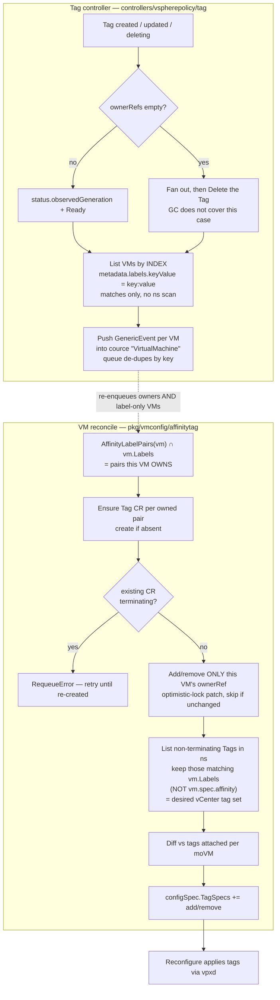

# Implementation Plan: Tag CRD + Tag Controller for Affinity

- **Spec**: [`spec.md`](./spec.md)
- **Model**: [`model.md`](./model.md)
- **Research**: [`research.md`](./research.md)
- **E2E plan**: [`e2e.md`](./e2e.md)
- **Epic**: vmop-3882
- **Date**: 2026-08-04

## Summary

Introduce a namespace-scoped `Tag` resource in the `vsphere.policy.vmware.com/v1alpha1` API that records which label key/value pairs currently participate in affinity in a namespace and which VMs own that participation. A new `vmconfig` reconciler on the VM path creates those resources, maintains its own VM's owner reference, and emits the vCenter `TagSpec` add/remove diff for **every** participating label the VM carries — including labels the VM does not itself reference. A new `Tag` controller owns `Tag` status, its finalizer, its delete-at-zero-owners decision, and fan-out to the VMs a `Tag` change affects. All of it is gated on a new `TaggingAPI` feature flag, which also un-gates mutability of `spec.affinity`.

## Technical context

- **Go version**: as declared in the root `go.mod` (unchanged by this feature).
- **API version(s) touched**: `vsphere.policy.vmware.com/v1alpha1` (new type `Tag`). No change to any `vmoperator.vmware.com` version; `api/` is untouched.
- **Modules touched**: root module (`controllers/`, `pkg/`, `webhooks/`, `config/`, `test/`), and `external/vsphere-policy` (new type + regenerated deepcopy).
- **New dependencies**: none.
- **Feature flag**: `pkgcfg.FromContext(ctx).Features.TaggingAPI`, defaulted `true` on this development branch, no Supervisor capability mapping yet (spec NG6).
- **Depends on**: `AsyncSignalEnabled` (default `true`) for the `cource`-based fan-out; the VM update flow's existing attached-tag fetch (step 3 of the documented VM update reconcile order) for the tag diff.
- **Interaction with the pre-existing flags**: `TaggingAPI` decides *whether the `Tag`-driven path runs*; it does **not** change which affinity terms are eligible. Term eligibility still comes from `CalculateAffinityConstraints`, i.e. `Features.VMPlacementPolicies` for zone-topology terms and `Features.VMAffinityDuringExecution` for host-topology terms, plus the VKS/zone-label exclusions. Consequence: with `TaggingAPI` on but both of those off, `AffinityLabelPairs` returns nothing and the feature is inert. That is deliberate — this spec does not re-open which terms are eligible (spec "Edge cases") — but it means enabling this flag alone is not sufficient to exercise the feature, which matters for test setup and for the eventual capability wiring (spec NG6).

## Constitution check

| Rule | Status | Notes |
|------|--------|-------|
| API compatibility — additive only, version bump + conversion webhook for breaking changes | OK | Brand-new type in an existing group/version. No existing field is changed, removed, or retyped, so no version bump and no conversion webhook (`model.md` "Conversion strategy"). |
| New CRD markers: `+kubebuilder:object:root=true`, `+groupName:`, deepcopy via `make generate-go` | OK | `Tag`/`TagList` carry the root marker; `+groupName=vsphere.policy.vmware.com` already exists in the module's `doc.go`; deepcopy regenerated in the module. |
| CRD manifests checked in, regenerated with `make generate-manifests` | OK | External types use `make generate-external-manifests`, which already covers `external/vsphere-policy/...`; output `config/crd/external-crds/vsphere.policy.vmware.com_tags.yaml` is checked in. |
| `+optional`/`+required` on every field, `omitempty` on optional | OK | See the marker column in `model.md` "Schema". |
| Resource names DNS-subdomain safe | OK | Name is `"tag-" + SHA1Sum17(...)` — always 21 safe characters (`model.md` "Name derivation"). |
| Controllers are thin; business logic in `pkg/` | OK | `controllers/vspherepolicy/tag/` holds the reconcile loop, finalizer, patch helper, index registration, and watch only; the label/affinity/tag-set computation lives in `pkg/util/vmopv1/affinitytag.go`, `pkg/util/kube/affinitytag.go`, and `pkg/vmconfig/affinitytag/`. |
| No controller calls vSphere directly | OK | Neither the `Tag` controller nor the fan-out touches vCenter. The only vCenter interaction is the `TagSpec` emission, which happens inside the provider's `vmconfig` reconciler chain and is applied by the existing reconfigure call. |
| Controllers track `status.observedGeneration` and set `Ready` | OK | `Tag` controller writes both (`model.md` "Status conditions"). |
| Fan-in writes to a shared list field use `client.MergeFromWithOptimisticLock` and skip when unchanged | OK | This is the ownership-write rule; see "Ownership write discipline" below. `controllerutil.CreateOrPatch` is deliberately **not** used for the ownership patch. |
| Controllers for other API groups not directly in `controllers/` | OK | `controllers/vspherepolicy/tag/`, registered from `controllers/vspherepolicy/controllers.go`. |
| Webhooks for other API groups not directly in `webhooks/` | OK | `webhooks/vspherepolicy/tag/validation/`. (Note: `webhooks/configtarget/` is a pre-existing divergence for `vim.vmware.com`; this feature follows the rule, not that precedent.) |
| Webhook validation logic in an unexported validator type, shared with unit tests | OK | `type validator struct` in the validation package, per the repository pattern. |
| CEL preferred for simple structural rules; Go for complex/cross-field | OK | Immutability is a cross-field transition rule and the privileged-account rule cannot be expressed in CEL, so a Go validator handles all of them together (D8). |
| RBAC documented with kubebuilder markers | OK | See `model.md` "RBAC". |
| One test file per package (`<package>_test.go`), one suite bootstrap | OK | Every new package gets exactly `<x>_test.go` + `<x>_suite_test.go`; no `_unit_test.go`/`_intg_test.go` split. |
| Labels from `pkg/constants/testlabels` on top-level `Describe` | OK | See "Test strategy". |
| Cluster-observable behavior ships with E2E in the same change set | OK | [`e2e.md`](./e2e.md); tasks T031-T033. |
| New feature flag requires spec + plan + tasks covering default, rollout, removal | OK | Spec NG6/G11, "Rollout / migration" below, and the follow-up list in `research.md`. |
| Markdown not hard-wrapped | OK | Applies to these artifacts. |
| Tickets masked as `vmop-NNN`, no internal URLs | OK | Epic `vmop-3882`; task tickets `vmop-11000`+. |
| Import aliases and grouping per `.golangci.yml` | OK | `vspherepolv1`, `vmopv1`, `pkgcfg`, `pkgctx`, `pkgutil`, `ctrlclient`, `ctrl`, `vimtypes`, `apierrors`, `metav1`. |

No constitutional rule is bent. "Complexity tracking" below records the three design points that deviate from a repository *default* (as opposed to a rule) and why.

## Project structure

New files:

```
external/vsphere-policy/api/v1alpha1/
  tag_types.go                                  # Tag, TagList, TagSpec, TagStatus, reason constants

pkg/util/kube/
  affinitytag.go                                # field index keys + indexer funcs (repo convention)
  affinitytag_test.go

pkg/util/vmopv1/
  affinitytag.go                                # shared, provider-free helpers (see below)
  affinitytag_test.go

pkg/vmconfig/affinitytag/
  affinitytag_reconciler.go                     # vmconfig.Reconciler: Tag CRs + TagSpec diff
  affinitytag_reconciler_suite_test.go
  affinitytag_reconciler_test.go

controllers/vspherepolicy/tag/
  tag_controller.go                             # status, finalizer, delete-at-zero-owners, fan-out
  tag_controller_suite_test.go
  tag_controller_test.go

webhooks/vspherepolicy/tag/
  webhooks.go                                   # AddToManager for the group's webhooks
  validation/
    tag_validator.go
    tag_validator_suite_test.go
    tag_validator_test.go

test/e2e/vmservice/vmservice/virtualmachine/
  vm_affinity_tag.go                            # E2E suite (see e2e.md)

config/crd/external-crds/
  vsphere.policy.vmware.com_tags.yaml           # generated
```

Modified files:

```
external/vsphere-policy/api/v1alpha1/zz_generated.deepcopy.go   # generated
pkg/config/config.go                                            # + Features.TaggingAPI
pkg/config/default.go                                           # flag default true (dev branch)
pkg/providers/vsphere/virtualmachine/affinity.go                # export the shared label extraction; keep the flag-off path
pkg/providers/vsphere/virtualmachine/configspec.go              # skip the create-time tag path when the flag is on
controllers/virtualmachine/virtualmachine/virtualmachine_controller.go  # register the vmconfig reconciler; + RBAC marker
controllers/vspherepolicy/controllers.go                        # register the Tag controller
webhooks/webhooks.go                                            # register the vspherepolicy webhooks
webhooks/virtualmachine/validation/virtualmachine_validator.go  # gate validateImmutableVMAffinity on the flag
test/builder/fake.go                                            # + Tag in KnownObjectTypes
config/rbac/role.yaml                                           # generated
config/crd/external-crds/README.md                              # note the new external CRD
test/e2e/vmservice/vmservice_test.go                             # register the new E2E context
test/e2e/vmservice/config/wcp.yaml                              # new wait-interval keys (see e2e.md)
test/e2e/vmservice/consts/consts.go                             # consts the E2E suite needs
```

Two things that look like they need changing and do **not**: the `generate-external-manifests` Makefile target already globs `external/vsphere-policy/...`, and `test/builder/test_suite.go` already loads the whole `config/crd/external-crds` directory into envtest, so the generated CRD is picked up by both without wiring. Likewise `test/e2e/vmservice/common/scheme.go` calls the module's `AddToScheme`, which picks `Tag` up via its `init()`.

## API / CRD strategy

Additive: a new kind in the existing `vsphere.policy.vmware.com/v1alpha1` group/version, no change to any shipped field, therefore no version bump and no conversion webhook. Full schema, markers, printer columns, name derivation, admission rules, and RBAC are specified in [`model.md`](./model.md).

Two generation steps are required and both outputs are checked in:

- `make generate-go` — deepcopy for the new types in the `external/vsphere-policy` module.
- `make generate-external-manifests` — `config/crd/external-crds/vsphere.policy.vmware.com_tags.yaml`. The Makefile target already passes `paths=github.com/vmware-tanzu/vm-operator/external/vsphere-policy/...`, so no Makefile change is needed.

`test/builder/fake.go`'s `KnownObjectTypes` must gain `&vspherepolv1.Tag{}` so the fake client enforces the status subresource split in unit tests (per `operator-best-practices.md`).

## Controller / webhook impact

### 1. Shared helpers — `pkg/util/vmopv1/affinitytag.go`

Provider-free, client-free pure functions, so both the VM path and the tests can use them without a session:

- `AffinityLabelPairs(vm *vmopv1.VirtualMachine, constraints) []LabelPair` — the label key/value pairs the VM's own `spec.affinity` references. This is today's `extractAffinityLabelsFromVM` logic, returning structured pairs instead of `"key:value"` strings, so the caller can build both a `Tag` spec and a vCenter tag name from one source of truth. `affinity.go`'s existing function is refactored to call this, so the flag-off path and the flag-on path cannot diverge in what "referenced by affinity" means.
- `TagResourceName(key, value string) string` — `"tag-" + pkgutil.SHA1Sum17(key + ":" + value)`.
- `VCenterTagName(key, value string) string` — `key + ":" + value`.

`AffinityRuleConstraints` and `CalculateAffinityConstraints` stay where they are; the new reconciler calls `CalculateAffinityConstraints(vmCtx, false)` so eligibility of host- vs zone-topology terms is decided by exactly the same rules as today (spec "Edge cases", VKS/zone-label case).

### 2. VM path — `pkg/vmconfig/affinitytag` (`vmconfig.Reconciler`)

Chosen because it is the only extension point in the VM reconcile path holding **both** a `ctrlclient.Client` and the outgoing `ConfigSpec` (see `research.md`). Registered per-reconcile from the VM controller, gated on the flag:

```go
if pkgcfg.FromContext(ctx).Features.TaggingAPI {
    ctx = vmconfig.Register(ctx, affinitytag.New())
}
```

`Reconcile(ctx, k8sClient, vimClient, vm, moVM, configSpec)` does, in order:

1. **Compute owned pairs** — `AffinityLabelPairs(vm, constraints)` intersected with the VM's own labels (after `kubeutil.RemoveVMOperatorLabels`). These are the pairs this VM **owns**. The intersection is deliberate: a pair the VM references but does not carry produces no `Tag` (spec "Edge cases"). This set drives steps 2 and 3 only — **not** step 5's tag diff.
2. **Ensure `Tag` resources exist** for every owned pair: `Get` by derived name; if `NotFound`, `Create` with spec, label mirror, and this VM's owner reference. If found with a non-zero `deletionTimestamp`, return `pkgerr.RequeueError{After: …}` — do not adopt, do not skip (spec G12). If found with a mismatched `spec.label`/`spec.value`, fail with a wrapped error (`model.md` "Collision handling").
3. **Reconcile own ownership** — add this VM's owner reference to each owned pair's `Tag` (already in hand from step 2) if absent; then `List` the `Tag`s this VM currently owns via the `metadata.ownerReferences.uid` index and remove its entry from any that is no longer an owned pair, or from all of them if the VM is being deleted. Both directions are index-driven — neither iterates the namespace's `Tag`s. Writes follow the ownership discipline below.
4. **Compute the desired vCenter tag set** — for each distinct label key on the VM, `List` `Tag`s by the `spec.label` field index and keep the non-terminating ones whose `spec.value` also matches (see "Field indexes and query patterns" below). Equivalently: the non-terminating `Tag`s in the namespace whose `spec.label`/`spec.value` matches one of **this VM's own labels**. This condition deliberately does **not** consult the VM's own `spec.affinity`: tag carriage follows labels plus `Tag` existence, ownership follows labels plus affinity (spec "Ownership vs. tag carriage"). This is the step that tags label-only VMs (spec G2), that keeps a VM tagged after it stops referencing a label it still carries (spec US3 scenario 2), and that makes participation namespace-wide rather than self-referential. Reusing the owned-pair set from step 1 here would be wrong on both counts.
5. **Emit the diff** — compare against the tags already attached per `moVM` and append `TagSpec{Operation: add}` for missing and `TagSpec{Operation: remove}` for extra members of the set. Only tags in the namespace's own category are considered for removal, so UUID-identified tags from the policy reconciler (mechanism B) and tags applied by anything else are never touched.

`OnResult` is a no-op: nothing needs to be recorded after the reconfigure, because ownership is Kubernetes-side state and the tag set is recomputed from live state every reconcile (level-triggered).

On VM deletion, step 3's removal branch runs from the VM's delete path so ownership is released before the VM's finalizer is removed; the all-owners-deleted case is additionally covered by ordinary garbage collection as a backstop.

### 3. Ownership write discipline

Every write to `Tag.metadata.ownerReferences` is:

```go
base := obj.DeepCopy()
// add or remove exactly this VM's entry
if !apiequality.Semantic.DeepEqual(base.OwnerReferences, obj.OwnerReferences) {
    if err := c.Patch(ctx, obj,
        client.MergeFromWithOptions(base, client.MergeFromWithOptimisticLock{})); err != nil {
        return err
    }
}
```

Mandated by the constitution for fan-in writes to a shared list field: several VMs write the same list, and a plain merge patch replaces list fields wholesale with no conflict detection, silently dropping a concurrent writer's entry. The optimistic lock turns that race into a conflict the next reconcile retries. `controllerutil.CreateOrPatch` is therefore not used here despite being the repository default for fan-out.

### 4. `Tag` controller — `controllers/vspherepolicy/tag`

Standard reconcile loop per `operator-best-practices.md`: `pkgcfg.JoinContext`, `cource.JoinContext`, `Get` with `IgnoreNotFound`, typed context, `patch.NewHelper` with a deferred patch, then the delete/normal split.

`ReconcileNormal`:

1. Ensure the `vmoperator.vmware.com/tag` finalizer; return immediately after adding it so it is persisted.
2. Correct the label mirror if `metadata.labels[spec.label] != spec.value`.
3. If `len(ownerReferences) == 0`, fan out (step 5) and `Delete` the `Tag` — this is the case ordinary garbage collection does not cover (`research.md`), and it is what satisfies spec US3 scenarios 1 and 3.
4. Otherwise set `status.observedGeneration` and `Ready` per `model.md`.
5. Fan out: `List` VMs with `client.InNamespace(tag.Namespace)` + `client.MatchingFields{kubeutil.VMLabelKeyValueIndexKey: tag.Spec.Label + ":" + tag.Spec.Value}` — an indexed lookup returning only the VMs that carry the label — and push one `event.GenericEvent` per VM into `cource.FromContextWithBuffer(ctx, "VirtualMachine", 100)`. The VM controller already consumes that channel, so this reconciles owners and label-only VMs alike (spec G2, US2).

   **Most of those reconciles are expected to be no-ops, and that is the design working as intended.** The fan-out is intentionally indiscriminate — it enqueues every VM carrying the label, not just the ones whose tag set actually changed — because deciding which VMs changed would require the `Tag` controller to reproduce each VM's tag diff, duplicating the VM path's logic against a stale view. Instead, each enqueued VM recomputes its own desired tag set from live state; if that set already matches the tags attached per `moVM`, step 5 of the VM path emits no `TagSpec`, no reconfigure is issued, and no `Tag` is patched. Three properties keep this cheap:

   - **Indexed fan-out**: the `List` returns only label-carrying VMs, so the enqueue count is the size of the affinity relationship, not the namespace.
   - **Workqueue de-duplication**: several `Tag` events for the same VM (e.g. two `Tag`s changing at once, or a create immediately followed by an ownership patch) collapse into one reconcile, because controller-runtime's queue de-duplicates by object key.
   - **Idempotent, level-triggered reconcile**: the no-op path performs reads only. It must not bump `resourceVersion` on the VM or on any `Tag`, which is what the skip-if-unchanged guard on the ownership patch enforces — otherwise a no-op fan-out would re-trigger watchers and loop.

`ReconcileDelete`: fan out exactly as in step 5, then remove the finalizer (spec G5, D10).

`AddToManager`: `For(&vspherepolv1.Tag{})`, `WithLogConstructor(pkglog.ControllerLogConstructor(...))`, registered from `controllers/vspherepolicy/controllers.go` behind the flag. No `Watches` on `VirtualMachine` is needed — each VM's own reconcile is what maintains ownership, and the VM's own reconcile is triggered by the VM controller's existing watches.

### 5. Field indexes and query patterns

Every hot-path `Tag` query is served either by a point read on the derived name or by a field index. This matters because `client.MatchingLabels` is **not** an indexed lookup: controller-runtime's cache maintains field indexes only, and a label selector is applied as an in-memory filter after the cache has returned every object in the namespace. The `metadata.labels` mirror therefore exists for the `kubectl get tags -l app=nginx` path, not for the controller's own queries.

Following the repository's convention for indexes (`pkg/util/kube/pvc.go`'s `VMSpecVolumesPVCsIndexKey` + `VMSpecVolumesPVCsIndexerFunc`, `pkg/util/kube/vmsnapshot.go`'s `VMSnapshotVMNameFieldIndex`), the index key constants and their extractor functions live in `pkg/util/kube/affinitytag.go`, and `AddToManager` on the `Tag` controller registers all four once against the shared manager cache, so every client built from that cache benefits:

| Index name | On | Indexed value | Serves |
|------------|----|---------------|--------|
| `spec.label` | `vspherepolv1.Tag` | `spec.label` | "give me every `Tag` for this label **key**" |
| `spec.labelKeyValue` | `vspherepolv1.Tag` | `spec.label + ":" + spec.value` | "give me the `Tag` for this exact key/value pair", without knowing the derived name |
| `metadata.ownerReferences.uid` | `vspherepolv1.Tag` | one entry per owner-reference UID | "which `Tag`s does this VM currently own?" |
| `metadata.labels.keyValue` | `vmopv1.VirtualMachine` | one `"<key>:<value>"` entry per label, after `kubeutil.RemoveVMOperatorLabels` | "give me every VM carrying this `Tag`'s label" — the `Tag` controller's fan-out |

The VM-side index is a multi-valued extractor, which is the same shape as the existing `VMSpecVolumesPVCsIndexerFunc` (one entry per referenced PVC), so it is idiomatic rather than novel here. Two details matter:

- **It must not mutate the cached object.** `kubeutil.RemoveVMOperatorLabels` returns a fresh map rather than filtering in place, so calling it from the extractor is safe.
- **Filtering out VM Operator's own labels keeps the index small and correct.** Reserved `vmoperator.vmware.com`-domain labels can never participate in affinity (the same filter governs today's `genConfigSpecTagSpecsFromVMLabels`), so indexing them would add entries that can never match a `Tag`.

Index size is bounded by (VMs × user labels per VM), which is the same order as the label maps already held in the cache — the index stores one short string per label, not a copy of the object.

Query patterns, in the order of how often they run:

| Question | How it is answered | Cost |
|----------|--------------------|------|
| Does a `Tag` for this exact key/value exist? | `Get` by `TagResourceName(key, value)` — the name is a pure function of the pair, so no search is needed at all | O(1) point read from the cache |
| Give me the `Tag` for this exact key/value, name unknown | `List` with `client.MatchingFields{"spec.labelKeyValue": key + ":" + value}` | indexed |
| Give me every `Tag` for this label key | `List` with `client.MatchingFields{"spec.label": key}` | indexed |
| Which `Tag`s does this VM own? | `List` with `client.MatchingFields{"metadata.ownerReferences.uid": string(vm.UID)}` | indexed |
| Which `Tag`s match any of this VM's labels? (step 4 of the VM path) | one `List` per **distinct label key** on the VM using the `spec.label` index, then an in-memory value comparison — **not** one list of the whole namespace | indexed, bounded by the VM's label count |
| Which VMs carry this `Tag`'s label? (`Tag` controller fan-out, spec US2) | `List` with `client.InNamespace(tag.Namespace)` + `client.MatchingFields{"metadata.labels.keyValue": tag.Spec.Label + ":" + tag.Spec.Value}` | indexed, returns matches only |

Every repeated query is indexed or a point read; none scans the namespace. In particular the fan-out `List` returns *only* the VMs that carry the label, so its cost scales with the size of the affinity relationship rather than with the number of VMs in the namespace — which is the property spec US2 needs, since that query runs on every `Tag` create, ownership change, and delete.

`client.MatchingLabels` is deliberately **not** used for the fan-out even though it reads more naturally: it would return every VM in the namespace from the cache and filter in memory afterward.

Note the interaction with the derived name (`model.md` "Name derivation"): because the name is a pure function of the key/value pair, the existence check on the write path — the most frequent query in the whole feature, run once per owned pair per VM reconcile — never needs a list or a selector at all. The two `spec.*` indexes exist for the read/diagnostic paths and for step 4, where the pair is not known up front.

### 6. Webhook — `webhooks/vspherepolicy/tag/validation`

An unexported `validator` implementing the repository's `builder.Validator` shape, with `+kubebuilder:webhook` markers for `CREATE`, `UPDATE`, and `DELETE` on `tags.vsphere.policy.vmware.com`. Rules V1-V6 are specified in `model.md` "Admission rules". Registered via a new `webhooks/vspherepolicy/webhooks.go` called from `webhooks/webhooks.go` behind the flag, mirroring how `virtualmachinegroup` and `virtualmachinesnapshot` are gated there.

### 7. `spec.affinity` mutability

`validateImmutableVMAffinity` in `webhooks/virtualmachine/validation/virtualmachine_validator.go` becomes conditional:

```go
if pkgcfg.FromContext(ctx).Features.TaggingAPI {
    return nil
}
```

Flag off: identical to today's behavior (spec G11, SC-006, US3 scenario 6). Flag on: `spec.affinity` is mutable, and the shape validation in `validateVMAffinity` continues to apply to the new value on update — the relaxation removes the immutability check only, not the structural checks.

### 8. Flag-off path preserved

`configspec.go` keeps calling `genConfigSpecTagSpecsFromVMLabels` — but only when the flag is **off**:

```go
if !pkgcfg.FromContext(vmCtx).Features.TaggingAPI {
    genConfigSpecTagSpecsFromVMLabels(vmCtx, &configSpec, affinityConstraints)
}
```

at both call sites (`CreateConfigSpec` and `CreateConfigSpecForPlacement`). The two mechanisms are mutually exclusive at runtime, never additive (D4) — otherwise a create would emit the same tag twice, from two code paths, with no owner bookkeeping behind one of them. `genConfigSpecAffinityPolicies` is untouched at both sites (spec NG5).

## Reconcile flow



## Test strategy

Per `testing-standards.md`: one `_test.go` and one `_suite_test.go` per package, external `_test` package, labels on the top-level `Describe`.

### Unit (`testlabels.Controller`, `testlabels.API`, `testlabels.Webhook`, `testlabels.Utils`)

- `pkg/util/kube/affinitytag_test.go` — the four index extractors: multi-label VMs, reserved-label filtering, empty values, prefixed keys, a VM with no labels, a `Tag` with several owner references.
- `pkg/util/vmopv1/affinitytag_test.go` — `AffinityLabelPairs` across `matchLabels`, `matchExpressions/In`, unsupported operators (ignored, not fatal), topology-key eligibility under each `AffinityRuleConstraints` combination, nil affinity; `TagResourceName`/`VCenterTagName` determinism, empty value, prefixed keys.
- `pkg/vmconfig/affinitytag/affinitytag_reconciler_test.go` — with the fake client: `Tag` created with correct name/spec/label-mirror/owner; second VM appends an owner rather than replacing the list; owner removed when affinity changes; owner removed on VM delete; terminating `Tag` yields a requeue rather than adoption or a silent skip; mismatched-spec collision errors; label-only VM gets `TagSpec{add}` and **no** owner reference; extra attached tag in the namespace category yields `TagSpec{remove}`; tags in other categories and UUID-identified tags are left alone; no-op reconcile emits no `TagSpec` and no patch.
- `controllers/vspherepolicy/tag/tag_controller_test.go` — finalizer add/remove; status/`observedGeneration`/`Ready`; label-mirror correction; delete-at-zero-owners; fan-out pushes one event per matching VM including label-only VMs and none for non-matching VMs; delete path fans out **before** releasing the finalizer.
- `webhooks/vspherepolicy/tag/validation/tag_validator_test.go` — V1-V6, each rule positive and negative, including the privileged-vs-DevOps account split and the derived-name check.
- `webhooks/virtualmachine/validation/virtualmachine_validator_test.go` — `spec.affinity` mutable with the flag on, rejected with it off.
- `pkg/providers/vsphere/virtualmachine/` existing affinity/configspec tests — extended so the flag-off path is asserted unchanged and the flag-on path emits no create-time tag specs (spec SC-006).

### Integration (`testlabels.EnvTest`, `testlabels.VCSim`)

- `controllers/vspherepolicy/tag/tag_controller_test.go` (envtest) — real garbage collection: deleting the last owning VM removes the `Tag`; deleting one of two owners does not; concurrent owner-reference writes from two VMs both survive (the optimistic-lock guarantee); all four field indexes resolve as specified, including the negative cases for `metadata.labels.keyValue` (same key with a different value, and VMs in another namespace); a no-op fan-out bumps no `resourceVersion` (`Consistently`); the CRD's printer columns and status subresource behave as generated. The generated CRD needs no test-suite wiring — `test/builder/test_suite.go` already loads the whole `config/crd/external-crds` directory into envtest.
- `pkg/providers/vsphere/session/session_vm_update_test.go` (vcsim) — the emitted `TagSpec`s reach the reconfigure call in the expected order relative to the other `vmconfig` reconcilers, and an attached-tag diff round-trips.

### E2E

Mandatory (spec G1-G10 are all cluster-observable). Specified in [`e2e.md`](./e2e.md): new suite `test/e2e/vmservice/vmservice/virtualmachine/vm_affinity_tag.go`, registered from `test/e2e/vmservice/vmservice_test.go`, `Label("experimental", …)` until validated on hardware per `e2e-testing.md`.

## Rollout / migration

- **Feature flag**: `pkgcfg.Features.TaggingAPI`, seeded `true` in `pkg/config/default.go` for this development branch. No entry is added to `pkg/config/capabilities/capabilities.go` yet, so no Supervisor capability can flip it — deliberate (spec NG6). Before this ships beyond the development branch, the follow-ups in `research.md` apply: add the capability key and return the default to `false`.
- **No schema upgrade / backfill**: nothing in `api/` changes and no VM field is backfilled. On a Supervisor where the flag is turned on for the first time, every VM's next reconcile converges its tags and creates whatever `Tag` resources its affinity implies — the feature is level-triggered, so no migration job is needed.
- **Turning the flag off** stops the `Tag`-driven path; already-applied vCenter tags and existing `Tag` resources are left in place (spec "Edge cases"), and the create-time mechanism resumes. This is a deliberate non-cleanup: proactively stripping tags on flag-off would disrupt placement for running VMs.
- **Partner comms**: none. The `Tag` API is internal (spec NG7) and DevOps-facing behavior only gains capability (`spec.affinity` becomes mutable, and affinity now includes label-only VMs). No user-facing documentation change is needed beyond the affinity mutability note in the release notes.
- **Release note**: affinity/anti-affinity now tags every VM in the namespace carrying a participating label, independent of `VirtualMachineGroup` membership, and `spec.affinity` becomes mutable when the feature is enabled.

## Complexity tracking

| Deviation | Why needed | Simpler alternative rejected because |
|-----------|------------|--------------------------------------|
| Ownership writes use `client.MergeFromWithOptions(base, MergeFromWithOptimisticLock{})` instead of the repository-default `controllerutil.CreateOrPatch` | `ownerReferences` is a shared **list** field written by every participating VM in the namespace | `CreateOrPatch`'s merge patch replaces list fields wholesale with no `resourceVersion` precondition, so a concurrent VM's owner entry is silently dropped with no error to trigger a retry — the exact failure the constitution's fan-in rule calls out |
| The `Tag` controller explicitly deletes a `Tag` at zero owners instead of relying on owner-reference garbage collection | Kubernetes GC deletes a dependent only when its owners are **deleted**, not when the owner list is emptied while the owners still exist | Relying on GC alone would leave a `Tag` (and therefore every label-only VM's vCenter tag) in place forever after an affinity change, breaking spec G4 and US3 scenarios 1 and 3. GC is retained as the backstop for the all-owners-deleted path |
| Two label→tag mechanisms coexist for one release | Keeps the change set reversible by flag and preserves the existing suites as the flag-off regression baseline (spec SC-006) | Deleting the create-time path now would make the flag one-way and remove the only baseline proving flag-off behavior is unchanged; removal is a tracked follow-up (spec NG4) |
